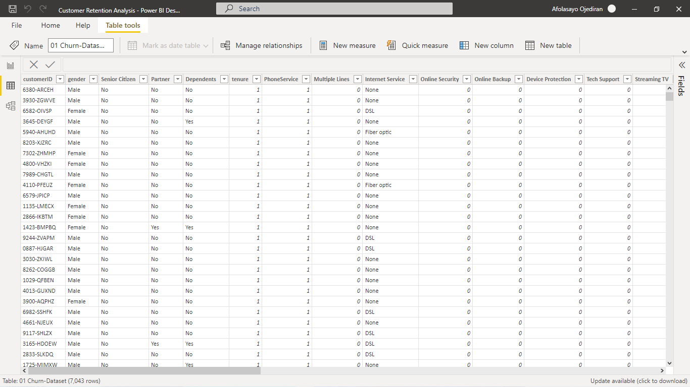
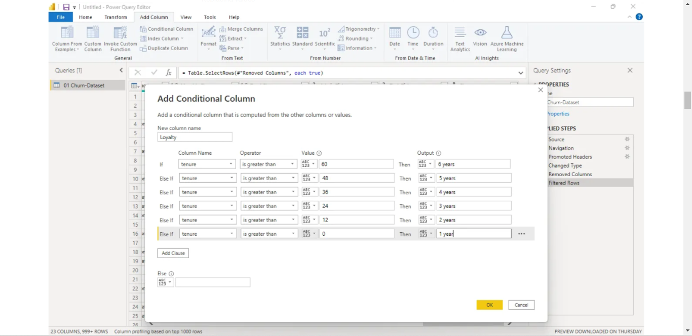
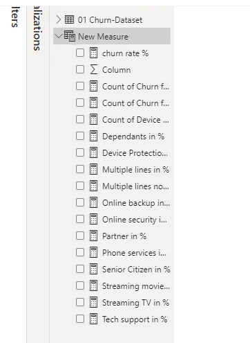
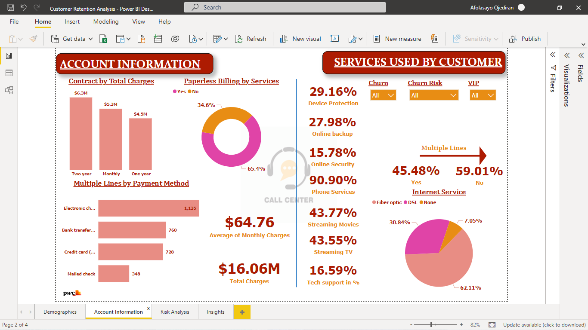
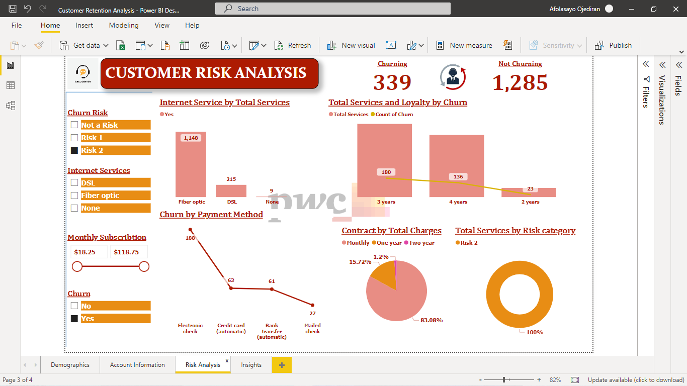

# PowerBI-Customer-Retention

# INTRODUCTION
---

Call Center customer retention is a crucial factor for any business that aims to provide excellent customer service. Retaining customers can help reduce costs associated with acquiring new ones, boost revenue, and increase customer loyalty. This task involves analyzing PhoneNow call center data and identifying key factors that influence customer retention.

# PROBLEM STATEMENT
1. Define proper KPIs
2. Create a dashboard for the retention manager reflecting the KPIs

## SKILLS DEMONSTRATED

- New Measures
- DAX
- Page Navigation
- Tooltips
- Power Query
- Additional Column

# METHODOLOGY

1. Data Collection and Cleaning in Power Query
2. Correcting errors
3. Replacing Values
4. Additional Columns:

- Loyalty (which describes how long a customer): Table.AddColumn(#"Added Conditional Column", "Loyalty", each if [tenure] < 12 then "< 1 year" else if [tenure] < 24 then "< 2 years" else if [tenure] < 36 then "< 3 years" else if [tenure] < 48 then "< 4 years" else if [tenure] < 60 then "< 5 years" else "< 6 years")

- Risk category: Table.AddColumn(#"Changed Type", "Risk category", each if [tenure] < 24 then "Risk 1" else if [tenure] < 48 then "Risk 2" else "Not at Risk")

5. Total Services: I calculated Total services by duplicating the following columns, after duplicating I replaced 'Yes' with 1 and 'No' with 0 to know the total service each customer subscribe to. The addition of these columns (DeviceProtection, MultipleLines, OnlineBackup, OnlineSecurity, PhoneService, StreamingMovies, StreamingTV, and TechSupport) was done via the standard calculator in Power Query.

6. New Mesures with DAX:

- Count of Churn for Yes = CALCULATE(COUNTA('churn'[Churn]), 'churn'[Churn] IN { "Yes" })

- DeviceProtection for Yes and No = CALCULATE(COUNTA('churn'[DeviceProtection]),'churn'[DeviceProtection] IN { "Yes" } )

- Count of DeviceProtection for Yes = CALCULATE( COUNTA('churn'[DeviceProtection]), 'churn'[DeviceProtection] IN { "Yes" } )

- Count of MultipleLines for Yes = CALCULATE( COUNTA('churn'[MultipleLines]), 'churn'[MultipleLines] IN { "Yes" } )

- Count of OnlineBackup for Yes = CALCULATE( COUNTA('churn'[OnlineBackup]), 'churn'[OnlineBackup] IN { "Yes" } )

- Count of OnlineSecurity for Yes = CALCULATE( COUNTA('churn'[OnlineSecurity]), 'churn'[OnlineSecurity] IN { "Yes" } )

- Count of PhoneService for Yes = CALCULATE( COUNTA('churn'[PhoneService]), 'churn'[PhoneService] IN { "Yes" } )

- Count of StreamingMovies for Yes = CALCULATE( COUNTA('churn'[StreamingMovies]), 'churn'[StreamingMovies] IN { "Yes" } )

- Count of StreamingTV for Yes = CALCULATE(COUNTA('churn'[StreamingTV]), 'churn'[StreamingTV] IN { "Yes" })

- Count of TechSupport for Yes = CALCULATE(COUNTA('churn'[TechSupport]), 'churn'[TechSupport] IN { "Yes" })

- Dependents in % = DIVIDE(CALCULATE(COUNT(churn[Dependents]), churn[Dependents]="Yes", churn[Churn]= "Yes"), CALCULATE(COUNT(churn[Dependents]), churn[Churn]="Yes"),0)

- Device protection in % = DIVIDE(CALCULATE(COUNT(churn[DeviceProtection]), churn[DeviceProtection]="Yes", churn[Churn]="Yes"),CALCULATE(COUNT(churn[DeviceProtection]),churn[Churn]="Yes"),0)

- Multiple lines no in % = DIVIDE(CALCULATE(COUNT(churn[MultipleLines]), churn[MultipleLines]="No", churn[Churn]="Yes"),CALCULATE(COUNT(churn[MultipleLines]),churn[Churn]="Yes", churn[MultipleLines] <> "No phone service"),0)

- Multiple Lines yes in % = DIVIDE(CALCULATE(COUNT(churn[MultipleLines]), churn[MultipleLines]="Yes", churn[Churn]= "Yes"), CALCULATE(COUNT(churn[MultipleLines]), churn[Churn]="Yes", churn[MultipleLines] <> "No phone service"),0)

- Online Bacup in % = DIVIDE(CALCULATE(COUNT(churn[OnlineBackup]), churn[OnlineBackup]="Yes", churn[Churn]="Yes"),CALCULATE(COUNT(churn[OnlineBackup]),churn[Churn]="Yes"),0)

- Online Sec. in % = DIVIDE(CALCULATE(COUNT(churn[OnlineSecurity]), churn[OnlineSecurity]="Yes", churn[Churn]="Yes"),CALCULATE(COUNT(churn[OnlineSecurity]),churn[Churn]="Yes"),0)

- Partner in % = DIVIDE(CALCULATE(COUNT(churn[Partner]), churn[Partner]="Yes", churn[Churn]= "Yes"), CALCULATE(COUNT(churn[Partner]), churn[Churn]="Yes"),0)

- Phone Service in % = DIVIDE(CALCULATE(COUNT(churn[PhoneService]), churn[PhoneService]="Yes", churn[Churn]="Yes"),CALCULATE(COUNT(churn[PhoneService]),churn[Churn]="Yes"),0)

- SeniorCitizen in % = DIVIDE(CALCULATE(COUNT(churn[SeniorCitizen]), churn[SeniorCitizen]=1, churn[Churn]= "Yes"), CALCULATE(COUNT(churn[SeniorCitizen]), churn[Churn]="Yes"),0)

- Streaming Movies in % = DIVIDE(CALCULATE(COUNT(churn[StreamingMovies]), churn[StreamingMovies]="Yes", churn[Churn]="Yes"),CALCULATE(COUNT(churn[StreamingMovies]),churn[Churn]="Yes"),0)

- Streaming TV in % = DIVIDE(CALCULATE(COUNT(churn[StreamingTV]), churn[StreamingTV]="Yes", churn[Churn]="Yes"),CALCULATE(COUNT(churn[StreamingTV]),churn[Churn]="Yes"),0)

- Tech Support in % = DIVIDE(CALCULATE(COUNT(churn[TechSupport]), churn[TechSupport]="Yes", churn[Churn]="Yes"),CALCULATE(COUNT(churn[TechSupport]),churn[Churn]="Yes"),0)

## VISUALISATION

1. **Churn/Customer Demographics**

2. Account Information and Services used by Customers

3. Risk Analysis

## CONCLUSION

It's important to regularly monitor customer retention rates and make adjustments as needed to ensure continued success.

RECOMMENDATIONS
1. Improve customer service.
2. Offer incentives for long-term contracts.
3. Enhance communication channels.
4. Improve internet services.
5. Target specific demographic groups

You can interact with the dashboard [here](https://app.powerbi.com/groups/me/reports/c89e6cc4-50f0-48e3-bc35-45629fb7f1c2/ReportSection8a3c83f05bd709390075)
